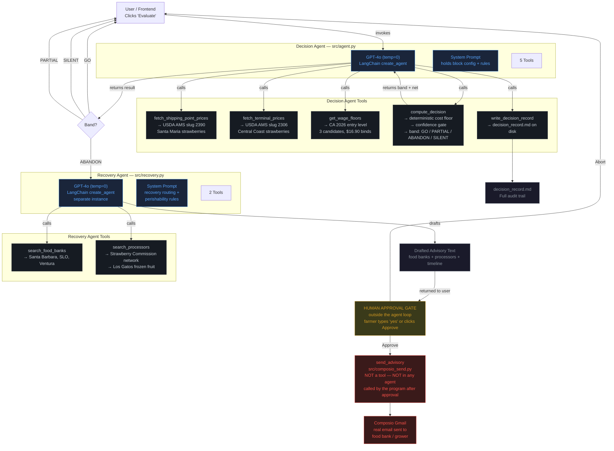

# Gleany — Agent Architecture

## Overview

Two LangChain agents, deterministic Python around them, and a hard human
approval gate that neither agent can cross. The model gathers and drafts.
The code computes and decides. The send happens only after a human types yes.



## Component breakdown

### Decision Agent (`src/agent.py`)

| Property | Value |
|---|---|
| Model | GPT-4o, temperature=0 |
| Harness | LangChain `create_agent` |
| System prompt | Holds block config (48 acres, Santa Maria, 9 picks) + workflow rules |
| Tools | 5 (see below) |
| Has `send_advisory`? | **No — by design** |

**Tools:**

| Tool | What it does | Returns |
|---|---|---|
| `fetch_shipping_point_prices` | Hits USDA AMS slug 2390, filters for Santa Maria strawberries | 2 rows (conventional + organic) with prices, data age |
| `fetch_terminal_prices` | Hits USDA AMS slug 2306, filters for Central Coast strawberries | 5 rows from LA terminal market |
| `get_wage_floors` | Returns 3 CA 2026 wage candidates and which binds | $16.90/hr (CA min wage) binds, $16.45 and $13.45 don't |
| `compute_decision` | Runs the deterministic pipeline: cost floor + confidence gate + bands | Band (GO/PARTIAL/ABANDON/SILENT), net per flat, cost breakdown |
| `write_decision_record` | Writes `decision_record.md` to disk | File path |

### Recovery Agent (`src/recovery.py`)

| Property | Value |
|---|---|
| Model | GPT-4o, temperature=0 |
| Harness | LangChain `create_agent` (separate instance) |
| System prompt | Recovery routing rules, perishability window (hours not days), both channels |
| Tools | 2 (see below) |
| Has `send_advisory`? | **No — by design** |
| When invoked | Only when band = ABANDON |

**Tools:**

| Tool | What it does | Returns |
|---|---|---|
| `search_food_banks` | Finds food banks near Santa Maria with cold storage and gleaning crews | Santa Barbara County Food Bank, SLO Food Bank, Food Share Ventura |
| `search_processors` | Finds processors that accept field-run strawberries | CA Strawberry Commission network, Los Gatos frozen fruit |

### Human Approval Gate

| Property | Value |
|---|---|
| Where | `run_full_demo.py` / `run_agent.py` / `src/api.py` |
| Who | The farmer / user |
| How | Types `yes` in terminal, or clicks "Approve" in the frontend |
| Is it a tool? | **No — it's a structural gate outside the agent loop** |

### send_advisory (`src/composio_send.py`)

| Property | Value |
|---|---|
| Is it a tool? | **No — neither agent can call it** |
| Who calls it | The program, after the human gate approves |
| What it does | Sends email via Composio Gmail (`GMAIL_SEND_EMAIL`) |
| Fallback | Terminal print if no Gmail account connected |

## The separation principle

```
WHAT THE MODEL DOES              WHAT PYTHON DOES (deterministic)
─────────────────────            ─────────────────────────────────
Calls tools in sequence           Fetches USDA data (httpx)
Extracts data from tool results   Selects binding wage floor
Summarises the decision           Computes cost floor arithmetic
Drafts advisory text              Applies confidence gate
Explains in plain language        Applies band thresholds
                                  Writes decision record
                                  Sends email (after human approval)

CAN'T do                         CAN'T do
─────────                        ─────────
Compute the cost floor            Hallucinate numbers
Select the wage floor             Make up market data
Apply the band threshold          Send email without approval
Send the email                    Deviate from the arithmetic
```

## Why not one agent?

The SPEC considered `deepagents` with subagent delegation and rejected it:

> *This workflow is a fixed pipeline with one branch. There is nothing for a
> planner to plan. The harness cost was not earning its keep in a two hour build.*

Two `create_agent` instances is simpler than one agent with conditional tool
sets. The recovery agent only spins up on the ABANDON branch, has its own
focused prompt, and can't accidentally call decision tools or vice versa.

## Why no send_advisory tool?

From the SPEC:

> *A hard gate outside the model is more defensible than an interrupt the model
> mediates, and it is faster to build.*

If the model had the send tool, it might send prematurely — even with
instructions not to. By not giving it the tool at all, the model **cannot**
send, regardless of what it "decides." The gate is enforced by the code's
structure, not by the model's compliance with a prompt.
