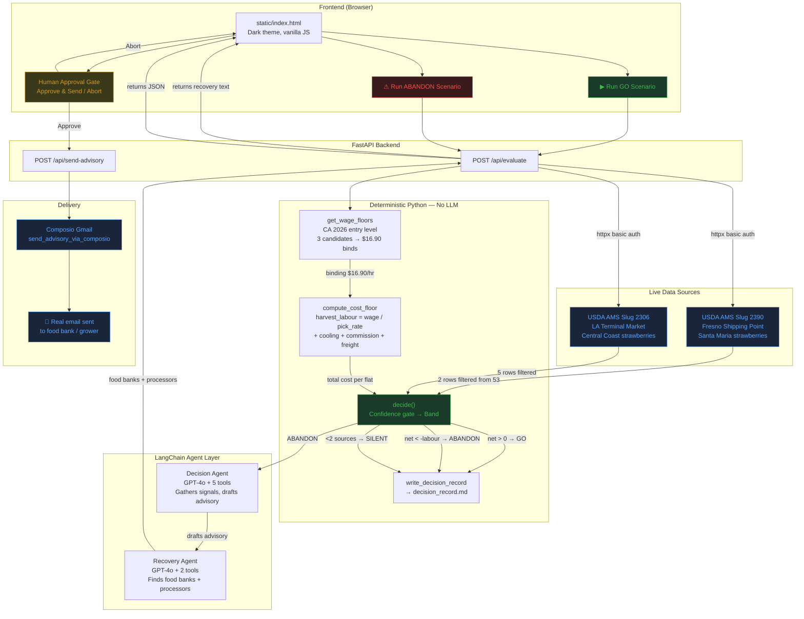

# Gleany — Workflow Diagram

## Flow explanation

### GO path (green)
1. User clicks "Run GO Scenario"
2. Backend fetches live prices from 2 USDA AMS sources
3. Wage floors selected — $16.90/hr (CA minimum wage) binds over $16.45 (OEWS) and $13.45 (H-2A adjusted)
4. Cost floor computed: labour $3.38 + cooling $1.50 + commission $0.96 + freight $2.00 = $7.84/flat
5. Net = $8.00 - $7.84 = **+$0.16/flat → GO**
6. Decision record written to disk
7. JSON returned to frontend, displayed

### ABANDON path (red)
1. User clicks "Run ABANDON Scenario" (higher placeholder costs)
2. Same price + wage pipeline runs
3. Cost floor = $11.98/flat, net = **-$3.98/flat → ABANDON**
4. Recovery agent finds food banks (Santa Barbara, San Luis Obispo, Ventura) + processors (Strawberry Commission network)
5. Advisory text returned to frontend
6. **Human Approval Gate** — user must click "Approve & Send"
7. Only after approval → Composio Gmail sends real email to sharvineeeducation@gmail.com
8. The agent never holds the send tool — structural gate, not prompted

### SILENT path (grey)
1. If fewer than 2 independent price sources → SILENT
2. If data_age_hours > 72 → SILENT
3. No action taken, reason recorded

### Key principle
**The agent gathers, the code decides.** The model extracts, summarises, and drafts.
The cost floor is arithmetic and the decision bands are thresholds — both are plain Python.
This makes the output auditable and stops the model from producing a plausible wrong number.
